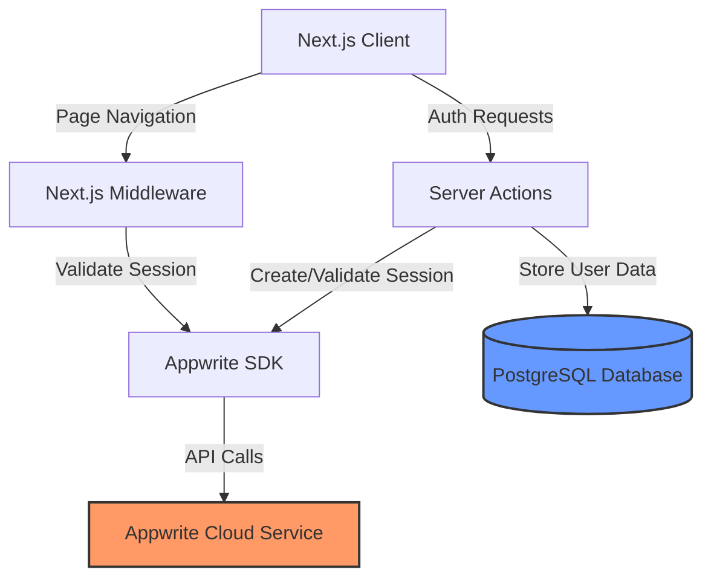
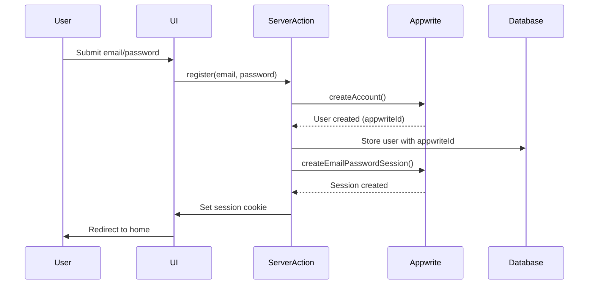
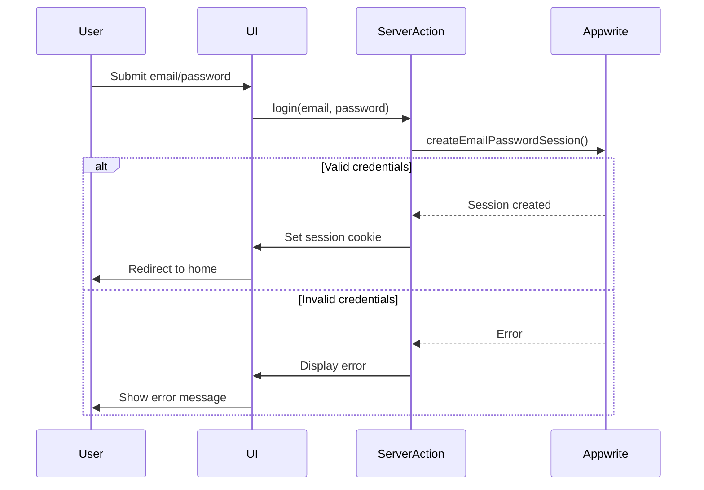
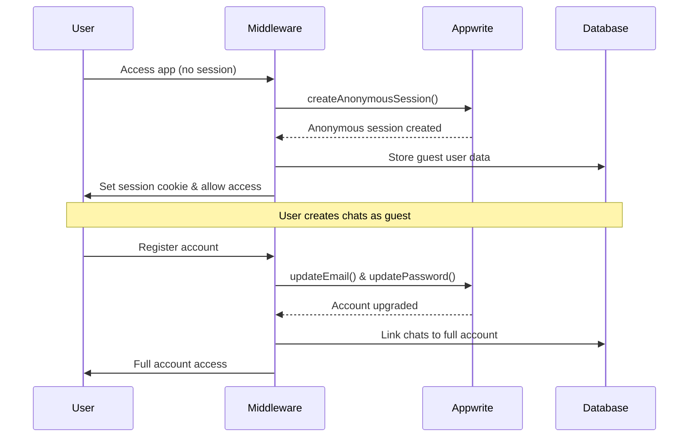

# Design Document

## Overview

This design document outlines the architecture and implementation approach for migrating DeepCounsel's authentication system from Auth.js (NextAuth v5 beta) to Appwrite's email authorization service. The migration will leverage Appwrite's managed authentication infrastructure while maintaining backward compatibility with existing user data and preserving the current user experience.

### Goals

- Replace NextAuth with Appwrite authentication
- Maintain guest user functionality using Appwrite anonymous sessions
- Preserve existing user data and chat history
- Ensure seamless session management across client and server
- Minimize disruption to existing users
- Simplify authentication codebase

### Non-Goals

- Implementing OAuth providers (can be added later)
- Adding two-factor authentication (future enhancement)
- Migrating to Appwrite database (keeping PostgreSQL)
- Changing UI/UX of authentication flows

## Architecture

### High-Level Architecture



### Authentication Flow

#### Registration Flow



#### Login Flow



#### Guest User Flow



## Components and Interfaces

### 1. Appwrite Client Configuration

**File:** `lib/appwrite/config.ts`

```typescript
interface AppwriteConfig {
  endpoint: string;
  projectId: string;
  apiKey: string;
  databaseId: string;
  userCollectionId: string;
}

// Server-side admin client (with API key)
function createAdminClient(): {
  account: Account;
  users: Users;
};

// Client-side SDK (no API key)
function createSessionClient(session?: string): {
  account: Account;
};
```

**Purpose:** Centralize Appwrite SDK initialization for both server and client contexts.

**Key Decisions:**

- Use admin client (with API key) for server-side operations requiring elevated permissions
- Use session client for user-specific operations
- Store configuration in environment variables
- Support both Node.js and Edge runtime environments

### 2. Authentication Service

**File:** `lib/appwrite/auth.ts`

```typescript
interface AuthService {
  // Account management
  createAccount(email: string, password: string, name?: string): Promise<User>;
  createEmailSession(email: string, password: string): Promise<Session>;
  deleteSession(sessionId: string): Promise<void>;
  getCurrentUser(): Promise<User | null>;

  // Guest user support
  createAnonymousSession(): Promise<Session>;
  upgradeAnonymousToAccount(email: string, password: string): Promise<User>;

  // Session management
  getSession(): Promise<Session | null>;
  refreshSession(): Promise<Session>;

  // Utilities
  isAnonymousSession(session: Session): boolean;
}
```

**Purpose:** Provide a clean interface for all authentication operations.

**Key Decisions:**

- Wrap Appwrite SDK calls with error handling
- Implement retry logic for network failures
- Return consistent error types
- Support both authenticated and anonymous sessions

### 3. Server Actions

**File:** `app/(auth)/actions.ts`

```typescript
type LoginActionState = {
  status: "idle" | "in_progress" | "success" | "failed" | "invalid_data";
  error?: string;
};

type RegisterActionState = {
  status:
    | "idle"
    | "in_progress"
    | "success"
    | "failed"
    | "user_exists"
    | "invalid_data";
  error?: string;
};

async function login(
  state: LoginActionState,
  formData: FormData
): Promise<LoginActionState>;
async function register(
  state: RegisterActionState,
  formData: FormData
): Promise<RegisterActionState>;
async function logout(): Promise<void>;
```

**Purpose:** Handle form submissions and coordinate between Appwrite and local database.

**Key Decisions:**

- Use Next.js server actions for form handling
- Validate input with Zod schemas
- Sync Appwrite user IDs to local database
- Set HTTP-only cookies for session management
- Return user-friendly error messages

### 4. Middleware

**File:** `middleware.ts`

```typescript
interface MiddlewareContext {
  request: NextRequest;
  session: Session | null;
  user: User | null;
  isAnonymous: boolean;
}

async function middleware(request: NextRequest): Promise<NextResponse>;
```

**Purpose:** Protect routes and manage session validation.

**Key Decisions:**

- Use Appwrite client SDK (compatible with Edge runtime)
- Validate session on every protected route
- Create anonymous session for unauthenticated users
- Redirect authenticated users away from auth pages
- Cache session validation results for performance

**Edge Runtime Compatibility:**

- Use `appwrite` (client SDK) instead of `node-appwrite` in middleware
- Client SDK is Edge runtime compatible
- Admin operations (requiring API key) handled in server actions only

### 5. Authentication Context

**File:** `components/providers/auth-provider.tsx`

```typescript
interface AuthContextValue {
  user: User | null;
  session: Session | null;
  isLoading: boolean;
  isAnonymous: boolean;
  login: (email: string, password: string) => Promise<void>;
  register: (email: string, password: string) => Promise<void>;
  logout: () => Promise<void>;
  refreshUser: () => Promise<void>;
}

function AuthProvider({ children }: { children: React.ReactNode }): JSX.Element;
function useAuth(): AuthContextValue;
```

**Purpose:** Provide client-side authentication state and methods.

**Key Decisions:**

- Use React Context for global auth state
- Fetch user on mount and after auth operations
- Provide loading states for UI feedback
- Expose auth methods for components
- Handle session expiration gracefully

### 6. Database Schema Updates

**File:** `lib/db/schema.ts`

```typescript
export const user = pgTable("User", {
  id: uuid("id").primaryKey().notNull().defaultRandom(),
  email: varchar("email", { length: 64 }).notNull(),
  password: varchar("password", { length: 64 }), // Deprecated, kept for migration
  appwriteId: varchar("appwriteId", { length: 64 }).unique(), // New field
  isGuest: boolean("isGuest").default(false), // Track guest status
  createdAt: timestamp("createdAt").notNull().defaultNow(),
  updatedAt: timestamp("updatedAt").notNull().defaultNow(),
});
```

**Purpose:** Link Appwrite users to local database records.

**Key Decisions:**

- Add `appwriteId` field to store Appwrite user ID
- Keep `password` field temporarily for migration
- Add `isGuest` flag for guest user tracking
- Maintain existing foreign key relationships
- Add timestamps for audit trail

### 7. Database Queries

**File:** `lib/db/queries.ts`

```typescript
interface UserQueries {
  // User management
  getUserByEmail(email: string): Promise<User | null>;
  getUserByAppwriteId(appwriteId: string): Promise<User | null>;
  createUser(
    email: string,
    appwriteId: string,
    isGuest?: boolean
  ): Promise<User>;
  updateUserAppwriteId(userId: string, appwriteId: string): Promise<void>;

  // Guest user management
  createGuestUser(appwriteId: string): Promise<User>;
  upgradeGuestUser(userId: string, email: string): Promise<void>;

  // Chat association
  transferGuestChats(guestUserId: string, newUserId: string): Promise<void>;
}
```

**Purpose:** Provide database operations for user management.

**Key Decisions:**

- Query by both email and Appwrite ID
- Support guest user creation and upgrade
- Handle chat history transfer during upgrade
- Remove password-related operations
- Add transaction support for data consistency

## Data Models

### User Model

```typescript
interface User {
  id: string; // Local database ID
  email: string; // User email
  appwriteId: string; // Appwrite user ID
  isGuest: boolean; // Guest user flag
  createdAt: Date; // Account creation timestamp
  updatedAt: Date; // Last update timestamp
}
```

### Session Model (Appwrite)

```typescript
interface Session {
  $id: string; // Session ID
  userId: string; // Appwrite user ID
  expire: string; // Expiration timestamp
  provider: string; // Auth provider (email, anonymous)
  providerUid: string; // Provider-specific user ID
  current: boolean; // Is current session
}
```

### Appwrite User Model

```typescript
interface AppwriteUser {
  $id: string; // Appwrite user ID
  email: string; // User email
  name: string; // User name
  emailVerification: boolean; // Email verified status
  prefs: Record<string, any>; // User preferences
}
```

## Error Handling

### Error Types

```typescript
enum AuthErrorCode {
  INVALID_CREDENTIALS = "invalid_credentials",
  USER_EXISTS = "user_exists",
  USER_NOT_FOUND = "user_not_found",
  SESSION_EXPIRED = "session_expired",
  NETWORK_ERROR = "network_error",
  RATE_LIMITED = "rate_limited",
  INVALID_INPUT = "invalid_input",
  APPWRITE_ERROR = "appwrite_error",
}

interface AuthError {
  code: AuthErrorCode;
  message: string;
  details?: any;
}
```

### Error Handling Strategy

1. **Network Errors:** Retry up to 3 times with exponential backoff
2. **Authentication Errors:** Return user-friendly messages without exposing system details
3. **Validation Errors:** Return specific field-level errors
4. **Server Errors:** Log details, show generic message to user
5. **Session Errors:** Automatically create anonymous session and redirect

### Error Logging

```typescript
interface ErrorLog {
  timestamp: Date;
  errorCode: AuthErrorCode;
  message: string;
  userId?: string;
  requestContext: {
    path: string;
    method: string;
    userAgent: string;
  };
  stackTrace?: string;
}
```

## Testing Strategy

### Unit Tests

**Target Files:**

- `lib/appwrite/config.ts` - SDK initialization
- `lib/appwrite/auth.ts` - Authentication methods
- `lib/db/queries.ts` - Database operations
- `app/(auth)/actions.ts` - Server actions

**Test Cases:**

- Account creation with valid/invalid data
- Session creation and validation
- Anonymous session creation
- Guest user upgrade
- Error handling for all operations
- Database query edge cases

### Integration Tests

**Test Scenarios:**

1. Complete registration flow (UI → Server Action → Appwrite → Database)
2. Complete login flow with session validation
3. Guest user creation and upgrade to full account
4. Session persistence across page reloads
5. Middleware route protection
6. Logout and session cleanup

### End-to-End Tests (Playwright)

**Test Scenarios:**

1. New user registration and automatic login
2. Existing user login
3. Guest user accessing app without registration
4. Guest user upgrading to full account with chat history preservation
5. Logout and redirect to login page
6. Protected route access without authentication
7. Session expiration handling

### Migration Testing

**Test Scenarios:**

1. Migrate existing users to Appwrite
2. Verify Appwrite ID storage in database
3. Test first login after migration
4. Verify chat history preservation
5. Test guest user migration

## Migration Strategy

### Phase 1: Preparation (No Downtime)

1. Add Appwrite SDK dependencies
2. Create Appwrite project and configure settings
3. Add `appwriteId` field to user table (nullable)
4. Deploy database migration
5. Create Appwrite utility files (no usage yet)

### Phase 2: Parallel Implementation (No Downtime)

1. Implement Appwrite authentication service
2. Create new server actions (alongside existing)
3. Update middleware to support both auth systems
4. Add feature flag to toggle between auth systems
5. Test Appwrite implementation in staging

### Phase 3: User Migration (Scheduled Maintenance)

1. Run migration script to create Appwrite accounts
2. Store Appwrite IDs in database
3. Send email notifications to users about password reset (if needed)
4. Verify migration success

### Phase 4: Cutover (Minimal Downtime)

1. Enable Appwrite authentication via feature flag
2. Disable NextAuth authentication
3. Monitor error rates and user feedback
4. Keep NextAuth code for rollback capability

### Phase 5: Cleanup (No Downtime)

1. Remove NextAuth dependencies
2. Delete unused authentication files
3. Remove `password` field from database (after grace period)
4. Update documentation
5. Remove feature flag

### Migration Script

```typescript
interface MigrationResult {
  totalUsers: number;
  migratedUsers: number;
  failedUsers: number;
  errors: Array<{ userId: string; error: string }>;
}

async function migrateUsersToAppwrite(): Promise<MigrationResult>;
```

**Migration Logic:**

1. Fetch all users from local database
2. For each user:
   - Create Appwrite account with email
   - Generate temporary password (user must reset)
   - Store Appwrite ID in local database
   - Log success/failure
3. Generate migration report
4. Send password reset emails to all users

## Security Considerations

### Session Security

- Use HTTP-only cookies for session storage
- Enable secure flag in production (HTTPS only)
- Set SameSite=Strict to prevent CSRF
- Configure appropriate session expiration (7 days default)
- Implement session refresh before expiration

### Password Security

- Appwrite handles password hashing (Argon2)
- Enforce minimum password length (6 characters)
- No password storage in local database
- Support password reset via Appwrite

### API Security

- Store Appwrite API key in environment variables
- Never expose API key to client
- Use admin client only in server-side code
- Validate all user inputs with Zod schemas
- Implement rate limiting on auth endpoints

### Data Privacy

- Store minimal user data in local database
- Use Appwrite user ID as reference
- Comply with data retention policies
- Support account deletion
- Encrypt sensitive data at rest

## Performance Considerations

### Session Validation

- Cache session validation results (5 minutes)
- Use Edge runtime for middleware (low latency)
- Implement session refresh to avoid re-authentication
- Minimize database queries in middleware

### Database Optimization

- Index `appwriteId` field for fast lookups
- Index `email` field for user queries
- Use connection pooling for database
- Implement query result caching where appropriate

### API Calls

- Batch Appwrite API calls where possible
- Implement retry logic with exponential backoff
- Set appropriate timeout values (5 seconds)
- Monitor API rate limits

### Client-Side Performance

- Lazy load authentication context
- Minimize re-renders on auth state changes
- Use React.memo for auth-dependent components
- Implement optimistic UI updates

## Monitoring and Observability

### Metrics to Track

- Authentication success/failure rates
- Session creation rate
- Anonymous session conversion rate
- API response times
- Error rates by type
- User registration rate

### Logging

- Log all authentication events
- Log API errors with context
- Log migration progress and results
- Implement structured logging (JSON format)
- Use log levels appropriately (info, warn, error)

### Alerts

- Alert on high authentication failure rate (>5%)
- Alert on Appwrite API errors
- Alert on database connection failures
- Alert on session validation failures
- Alert on migration script failures

## Rollback Plan

### Rollback Triggers

- Authentication failure rate >10%
- Critical bugs in production
- Appwrite service outage
- Data integrity issues

### Rollback Steps

1. Disable Appwrite authentication via feature flag
2. Re-enable NextAuth authentication
3. Verify system functionality
4. Investigate and fix issues
5. Plan re-deployment

### Data Consistency

- Keep NextAuth code until migration is stable
- Maintain `password` field in database during transition
- Implement dual-write during migration period
- Regular database backups before major changes

## Future Enhancements

### OAuth Providers

- Add Google OAuth
- Add GitHub OAuth
- Add Microsoft OAuth
- Implement provider linking

### Enhanced Security

- Implement two-factor authentication
- Add magic link authentication
- Implement passkey support
- Add device management

### User Experience

- Add email verification flow
- Implement password strength meter
- Add "remember me" functionality
- Implement account recovery options

### Analytics

- Track authentication method usage
- Monitor guest-to-registered conversion
- Analyze session duration patterns
- Track authentication errors by type
